<div align="center">

# svgcast

**別再往 README 裡塞模糊的 GIF。**

把 [asciinema](https://asciinema.org) 的錄影轉成動畫 SVG——比同一份錄影的 GIF 小 3–8 倍、
任意縮放都清晰，而且**同一個檔案就能跟著讀者的深色／淺色模式切換**。

[](https://github.com/co2water/svgcast/actions/workflows/ci.yml)
[](https://github.com/co2water/svgcast/releases)
[](https://goreportcard.com/report/github.com/co2water/svgcast)
[](LICENSE)

[English](README.md) | 繁體中文

</div>



<p align="center"><i>上面這張 demo 只有 17.5 KB；同一份錄影做成 GIF 是 64 KB。它就是用畫面裡那行指令產生的。</i></p>

## 安裝

```bash
npx svgcast demo.cast -o demo.svg                          # 免安裝直接用
brew install co2water/tap/svgcast                          # macOS / Linux
go install github.com/co2water/svgcast/cmd/svgcast@latest
```

或到 [Releases](https://github.com/co2water/svgcast/releases) 下載二進位檔——macOS／Linux／Windows
各一個單一靜態檔案，沒有任何相依。

## 使用

```bash
asciinema rec demo.cast
svgcast demo.cast -o demo.svg
```

就這樣。svgcast **不做錄製**——[asciinema](https://asciinema.org) 已經把錄製做得很好了，
svgcast 只負責轉換。

```bash
svgcast demo.cast -o demo.svg --still preview.svg   # 順便輸出一張靜態預覽
svgcast demo.cast -o demo.svg --theme dark          # 強制單一配色
svgcast demo.cast -o demo.svg --idle-time-limit 2s  # 把長時間的停頓壓掉
svgcast demo.cast -o demo.svg --from 5s --to 1m     # 只取某一段
```

## 為什麼不用 GIF

|              | GIF          | svgcast SVG      |
| ------------ | ------------ | ---------------- |
| 縮放／HiDPI  | 模糊         | 任何尺寸都清晰   |
| 深色模式     | ❌ 做不到     | ✅ 同一個檔案自動切換 |
| 文字可選取   | ❌            | ✅                |
| 螢幕閱讀器   | ❌            | ✅                |

後三項不是「svgcast 做得比較好」，而是**點陣圖結構上做不到的事**。GIF 是一格一格的像素，
只有一套調色盤、沒有文字、螢幕閱讀器讀不到任何東西。

體積是用**同一份錄影**量的——GIF 由 [agg](https://github.com/asciinema/agg)（asciinema 官方的
GIF 產生器，預設設定）產生，SVG 由 svgcast（預設設定）產生：

| 錄影                                   | GIF (agg) | SVG (svgcast) |  比例 |
| -------------------------------------- | --------: | ------------: | ----: |
| 上面的 demo（68×12，11 秒）             |   64.4 KB |       17.5 KB |  3.7× |
| 30 行捲過畫面（60×12，4 秒）            |   44.2 KB |        8.3 KB |  5.3× |
| 一般 session（80×24，15 秒，5 個指令）  |  197.1 KB |       23.7 KB |  8.3× |

終端越大、錄影越長，差距越大：GIF 每一格的每一個像素都要付錢，SVG 只為變動的部分付錢。
可以用 `make sizes` 重現（需要 PATH 上有 `agg`）。

## 深色模式

一個檔案。SVG 裡同時帶著兩套配色和一條 `prefers-color-scheme` media query，
讀者的系統是什麼主題，它就顯示什麼主題。

GitHub 官方推薦的做法需要**兩個檔案**——`<picture>` 加一個
`<source media="(prefers-color-scheme: dark)">` 再加兩張圖。svgcast 一個就夠。

## Nerd Font／Powerline 符號

這些符號放在 Unicode 的私用區。README 裡的圖片是用 `` 載入的，那是沙箱模式：
**外部字型永遠不會被下載**。讀者機器上沒裝你的字型，那些符號就是一個個空白方框。

`--embed-font` 解決這件事的方式是：**只把錄影裡實際用到的那幾個符號抽出輪廓嵌進去**——
幾個 `<path>` 元素，而不是好幾 MB 的整個字型檔：

```bash
svgcast demo.cast -o demo.svg --embed-font ~/.fonts/FiraCodeNerdFont-Regular.ttf
```

一般文字仍然是 `<text>`，維持可選取。

## 讓 demo 在 CI 裡自動更新

跟工具本身脫節的 demo，比沒有 demo 更糟。這個 action 會在每次 push 時重新產生你的 `.cast`：

```yaml
- uses: co2water/svgcast/action@v1
  with:
    input: docs/*.cast
    args: --idle-time-limit 2s
```

## 旗標

```
-o <file>                輸出檔（預設：輸入檔換成 .svg）
--still <file>           另外輸出一張靜態預覽 SVG
--theme auto|light|dark  配色（預設 auto：跟著讀者的系統主題）
--embed-font <ttf>       嵌入用到的私用區字符輪廓
--speed <n>              播放倍率
--from / --to <dur>      只取某一段，例如 --from 5s --to 1m30s
--idle-time-limit <dur>  把超過此長度的停頓壓掉，例如 2s
--no-loop                只播一次，不循環
--no-cursor              不畫游標方塊
--font <family>          font-family 的 fallback 鏈
```

時間一律用你會怎麼說就怎麼寫（`5s`、`1m30s`），不是毫秒數。

## 為什麼又做一個

這個需求早就被證明過，只是沒人在維護：

| 專案                                                        |     ★ | 最後更新                |
| ----------------------------------------------------------- | ----: | ----------------------- |
| [termtosvg](https://github.com/nbedos/termtosvg)            | 9,756 | 2020 · 已封存           |
| [svg-term-cli](https://github.com/marionebl/svg-term-cli)   | 4,245 | 2024 · 48 個未處理 issue |

svgcast 針對的是**兩邊都被要求修、但都沒人修**的三件事：

1. **Powerline／Nerd Font 符號不再逐漸偏移。** termtosvg 的
   [#14](https://github.com/nbedos/termtosvg/issues/14) 從 2018 年開到現在。病根是字型的
   前進寬度跟格子對不上；svgcast 給每一段文字明確的 `x` 座標，誤差不可能累積。
2. **檔案小。** 差分影格、連續段合併、捲動用 viewport 平移而不是整個畫面重畫、
   嵌字符輪廓而不是子集化整個字型。
3. **大錄影不會爆。** 50,000 個事件約 5 秒轉完，峰值記憶體約 43 MB。影格是串流處理的，
   從不整份留在記憶體裡。

## 已知限制

- **CJK 等雙寬字元會錯位。** 底層的終端模擬器（[vt10x](https://github.com/hinshun/vt10x)）
  不追蹤字元寬度，一個字元一律前進一格。ASCII、Powerline 與 Nerd Font 符號不受影響。
- **私用區字元一律當一格寬。** 這是刻意的：Powerline 與 Nerd Font 的符號就是設計成佔一格，
  而標準寬度表把私用區歸類為「寬度不定」——照表做會讓整行往右滑，那正是 termtosvg #14。
- **不做 blink。** termtosvg 有一個「blink 不會閃」的 issue；svgcast 選擇明確不做，
  而不是做一個會壞的版本。
- **faint 與 strikethrough 會被丟掉。** vt10x 不追蹤這兩個屬性。
- **主題跟的是作業系統的 `prefers-color-scheme`，不是你在 GitHub 的主題設定。**
  GitHub 官方的 `<picture>` 做法有一模一樣的限制。

## 貢獻

歡迎 issue 與 pull request。送出前請跑 `make check`（gofmt、vet、測試）。

## 授權

[Apache-2.0](LICENSE)
